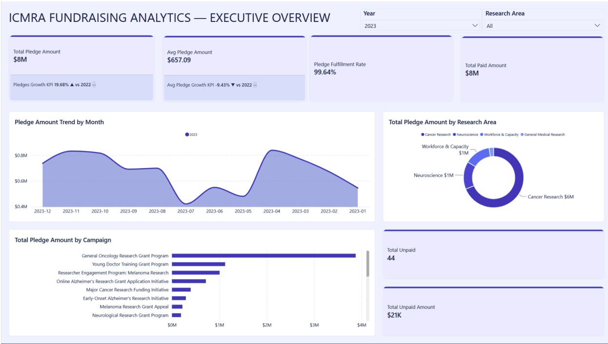

# ICMRA Strategic Analytics 2019-2025

Power BI fundraising analytics project for the International Consortium for Medical Research Advancement (ICMRA). The work analyzes 2019-2025 fundraising performance, donor behavior, campaign concentration, and board-level risk using the Power BI report, executive infographic, and source dashboard file in this repository.

## Project Outputs

- [`assets/fin-bi-powerbi-dashboard.pbix`](assets/fin-bi-powerbi-dashboard.pbix) - Power BI dashboard file
- [`assets/icmra-strategic-analytics-report.pdf`](assets/icmra-strategic-analytics-report.pdf) - full strategic analytics report
- [`assets/icmra-strategic-analytics-2019-2025.pdf`](assets/icmra-strategic-analytics-2019-2025.pdf) - one-page executive infographic
- [`assets/dashboard-preview.png`](assets/dashboard-preview.png) - dashboard preview from the report
- [`assets/icmra-executive-infographic.png`](assets/icmra-executive-infographic.png) - rendered infographic preview

## Executive Summary

The report covers `$32.93M` in total pledges from `2,330` unique donors across `45,100` transactions. Campaign ROI reached `1,077%`, equivalent to `$11.78` raised per `$1` of campaign budget.

The analysis also identifies a clear inflection point. After rapid growth from 2019 to 2023, revenue declined by `17.3%` in 2024 and another `27.5%` in 2025. The report frames this as a sustainability risk driven by geographic concentration, campaign concentration, and donor type concentration.

## Core Insights

- Revenue grew from `$821K` in 2019 to `$8.06M` in 2023 before falling to `$6.66M` in 2024 and `$4.83M` in 2025.
- The United States contributes about `70.7%` of revenue, creating geographic concentration risk.
- One campaign, `Cam-Res-App-242`, contributes `50.3%` of total revenue.
- Household donors account for `94.9%` of revenue, while enterprise, foundation, and government channels remain underdeveloped.
- Champions and Loyal donors represent `90.9%` of revenue, with Champions contributing `$10.81M` and Loyal donors contributing `$19.12M`.
- The 2019 and 2020 donor cohorts show the strongest long-term value, while recent cohorts are materially smaller.

## Analysis Techniques

- Power Query data cleaning and type enforcement
- Data quality assessment across `45,100` transaction rows
- Power BI semantic modeling and date table creation
- RFM donor segmentation
- Customer lifetime value and churn analysis
- Market basket analysis for cross-campaign affinity
- What-if scenario planning for budget and target adjustment
- Cohort analysis for donor retention and long-term value

## Strategic Recommendations

1. Establish a revenue recovery task force to investigate the 2024-2025 decline.
2. Diversify geographically beyond the United States and the Americas.
3. Expand donor types beyond household donors into enterprise, foundation, and government channels.
4. Rebalance the campaign portfolio to reduce dependency on a single campaign.
5. Reassess campaign budget allocation against the `$12.04M` target gap.
6. Invest in donor acquisition and convert Potential Loyalist donors into Champions.

## Stack

Power BI, Power Query, DAX-style BI modeling, RFM segmentation, CLV analysis, cohort analysis, market basket analysis, what-if parameters, executive reporting, and fundraising analytics.
