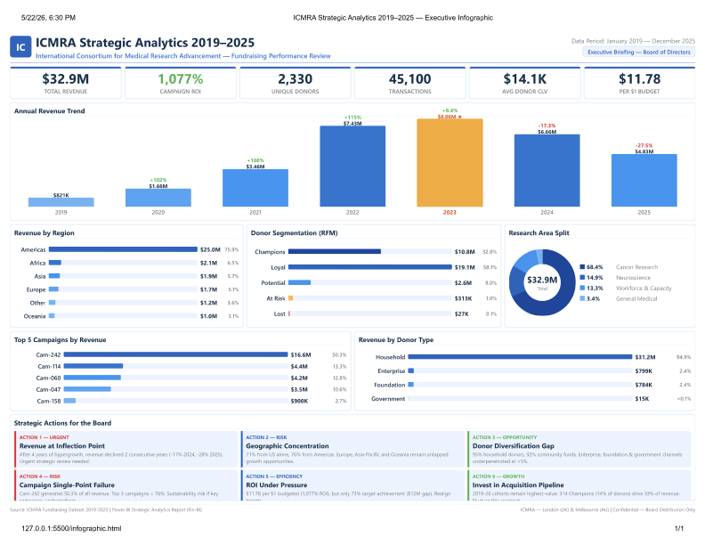

# ICMRA Strategic Analytics 2019-2025

Power BI and executive infographic project for an ICMRA fundraising performance review across January 2019 to December 2025.

## Project Outputs

- [`assets/fin-bi-powerbi-dashboard.pbix`](assets/fin-bi-powerbi-dashboard.pbix) - Power BI dashboard file
- [`assets/icmra-strategic-analytics-2019-2025.pdf`](assets/icmra-strategic-analytics-2019-2025.pdf) - executive infographic export
- [`assets/icmra-executive-infographic.png`](assets/icmra-executive-infographic.png) - dashboard preview image

## Analysis Scope

The dashboard summarizes fundraising performance and donor behaviour across:

- annual revenue trends from 2019 to 2025
- campaign ROI and top campaigns by revenue
- donor segmentation using RFM-style groups
- revenue by region and donor type
- research area split
- board-level action priorities

## Highlighted Metrics

- Total revenue: `$32.9M`
- Campaign ROI: `1,077%`
- Unique donors: `2,330`
- Transactions: `45,100`
- Average donor CLV: `$14.1K`
- Per-dollar budget return: `$11.78`

## Stack

Power BI, DAX-style BI modelling, executive reporting, fundraising analytics, donor segmentation, and dashboard storytelling.
